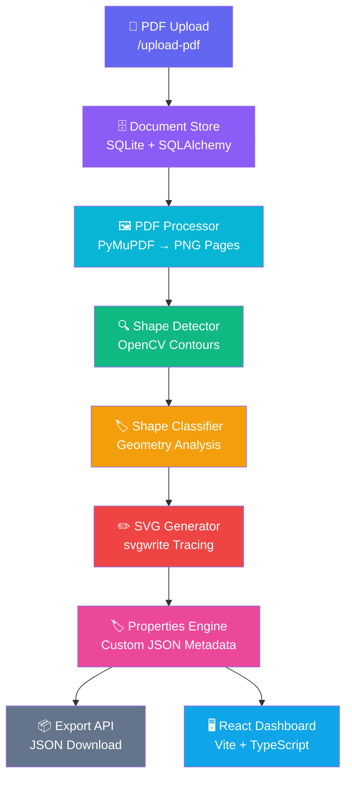

# 🔷 ShapeForge AI — PDF2EditableSymbols

<div align="center">

[](https://python.org)
[](https://fastapi.tiangolo.com)
[](https://reactjs.org)
[](https://opencv.org)
[](https://typescriptlang.org)
[](https://sqlite.org)
[](https://opensource.org/licenses/MIT)

**Extract shapes from engineering PDF diagrams and transform them into editable vector SVG symbols with custom metadata.**

[Live Demo](#) · [API Docs](http://localhost:8000/docs) · [Report Bug](https://github.com/Aditya452255/ShapeForge-AI/issues) · [Request Feature](https://github.com/Aditya452255/ShapeForge-AI/issues)

</div>

---

## 🧩 Overview

### The Problem

Engineering firms, P&ID designers, and technical documentation teams work with large PDF diagrams containing hundreds of symbols — pumps, valves, sensors, and instrumentation devices. These symbols are locked inside raster images with no metadata, no editability, and no programmatic access.

### The Solution

**ShapeForge AI** is a full-stack intelligent symbol extraction platform that:

1. **Ingests** engineering PDF diagrams via a REST API
2. **Converts** each page into high-resolution PNG images using PyMuPDF
3. **Detects** all symbol contours using OpenCV computer vision algorithms
4. **Classifies** each shape (circle, rectangle, triangle, complex polygon) using geometry analysis
5. **Vectorizes** cropped shapes into editable SVG files using svgwrite
6. **Tags** every symbol with custom JSON properties via a properties engine
7. **Exports** complete shape metadata as structured JSON
8. **Presents** everything through an interactive React TypeScript dashboard

### Business Value

| Before ShapeForge AI | After ShapeForge AI |
|---|---|
| Manual symbol tracing (hours/days) | Automated extraction (minutes) |
| Raster images with no metadata | Editable SVG with structured properties |
| No programmatic access to diagrams | Full REST API with JSON export |
| Static PDF documentation | Interactive digital twin symbols |

---

## ✨ Features

### 📤 PDF Upload Engine
- Multipart file upload with format validation
- Secure storage with unique document IDs (UUID)
- Metadata persistence in SQLite via SQLAlchemy ORM
- Duplicate detection and error handling

### 🖼️ PDF Processing Pipeline
- High-resolution PDF → PNG conversion at 300 DPI equivalent (matrix scale 2.0)
- Per-page image storage with dimension metadata
- Supports multi-page engineering diagrams
- PyMuPDF rendering with configurable resolution

### 🔍 Shape Detection Engine
- OpenCV `RETR_CCOMP` contour retrieval (handles nested shapes in bordered diagrams)
- Adaptive binary thresholding for black-line-on-white engineering diagrams
- Morphological close operations for noise removal
- Configurable area filters (`MIN_CONTOUR_AREA`, `MAX_CONTOUR_AREA`)
- Cropped shape PNG export per detected symbol

### 🏷️ Shape Classification Engine
- Geometry-based classification without ML model dependency
- Detects: `circle`, `rectangle`, `triangle`, `ellipse`, `polygon`
- Confidence scoring based on aspect ratio and vertex analysis
- OpenCV `approxPolyDP` and `minEnclosingCircle` algorithms

### ✏️ SVG Generation Engine
- Contour-to-SVG tracing using `svgwrite`
- Normalized coordinate mapping (shape-relative coordinate space)
- Smooth Bezier-approximated paths
- Each SVG is independently editable in Inkscape, Figma, Adobe Illustrator

### 🏷️ Custom Properties Engine
- Merge (`PATCH`) and replace (`PUT`) property operations
- Free-form JSON key-value metadata per shape
- Supports: `tag_number`, `manufacturer`, `material`, `pressure_rating`, `notes`, etc.
- All properties persisted in SQLite and exportable

### 📦 Metadata Export
- Full JSON export of all shapes for a document
- Includes: bounding box, shape type, confidence, SVG path, and custom properties
- Downloadable via single API call or dashboard button

### 🖥️ Interactive React Dashboard
- Document workspace with pipeline status indicator
- Step-by-step pipeline controls (Extract → Detect → Vectorize)
- Shape grid with type badges and confidence scores
- Inline SVG viewer with zoom and pan
- Property editor with live save
- Responsive Tailwind CSS design

---

## 🏗️ Architecture



### Data Flow

```
PDF File
  ↓ [POST /upload-pdf]
Document Record (UUID, filename, path, timestamp)
  ↓ [POST /documents/{id}/process]
Page Records (page_number, image_path, width, height)
  ↓ [POST /documents/{id}/detect-shapes]
Shape Records (bbox, shape_type, confidence, crop_path)
  ↓ [POST /documents/{id}/generate-svg]
SVG Files (normalized vector paths)
  ↓ [PATCH /shapes/{id}/properties]
Custom Properties (free-form JSON metadata)
  ↓ [GET /documents/{id}/export]
Complete JSON Export
```

---

## 📁 Project Structure

```
ShapeForge-AI/
├── app/                          # FastAPI backend application
│   ├── api/
│   │   ├── deps.py               # Dependency injection (DB session)
│   │   └── endpoints.py          # All REST API route handlers
│   ├── core/
│   │   ├── config.py             # Pydantic settings from .env
│   │   └── logging.py            # Structured logging configuration
│   ├── database/
│   │   └── session.py            # SQLAlchemy engine + session factory
│   ├── models/
│   │   ├── document.py           # Document ORM model
│   │   ├── page.py               # Page ORM model
│   │   └── shape.py              # Shape ORM model
│   ├── schemas/
│   │   ├── document.py           # Document Pydantic schemas
│   │   ├── page.py               # Page Pydantic schemas
│   │   └── shape.py              # Shape Pydantic schemas
│   ├── services/
│   │   ├── document_service.py   # PDF upload + document CRUD
│   │   ├── pdf_processor.py      # PyMuPDF PDF → PNG pipeline
│   │   ├── shape_detector.py     # OpenCV contour detection
│   │   ├── shape_classifier.py   # Geometry-based classification
│   │   ├── svg_generator.py      # svgwrite SVG tracing
│   │   └── property_service.py   # Custom properties CRUD
│   └── main.py                   # FastAPI app factory + lifespan
│
├── frontend/                     # React TypeScript dashboard
│   ├── src/
│   │   ├── api/
│   │   │   ├── client.ts         # Axios base client (120s timeout)
│   │   │   ├── documents.ts      # Document API calls
│   │   │   └── shapes.ts         # Shape API calls
│   │   ├── components/
│   │   │   ├── Navbar.tsx        # Top navigation bar
│   │   │   ├── UploadCard.tsx    # Drag-and-drop PDF uploader
│   │   │   ├── DocumentList.tsx  # Document library grid
│   │   │   ├── ShapeGrid.tsx     # Shape gallery grid
│   │   │   ├── ShapeCard.tsx     # Individual shape card
│   │   │   ├── SVGViewer.tsx     # Inline SVG viewer with zoom
│   │   │   ├── PropertyEditor.tsx# Custom property key-value editor
│   │   │   └── LoadingSpinner.tsx# Shared loading state component
│   │   ├── pages/
│   │   │   ├── Dashboard.tsx     # Main landing page
│   │   │   ├── DocumentDetail.tsx# Document pipeline control center
│   │   │   └── ShapeDetail.tsx   # Individual shape inspector
│   │   ├── types/                # TypeScript interface definitions
│   │   ├── App.tsx               # Router and layout
│   │   └── main.tsx              # Vite entry point
│   ├── package.json
│   ├── tailwind.config.js
│   └── vite.config.ts
│
├── tests/                        # Pytest test suite
│   ├── test_pdf_processing.py    # PDF → PNG pipeline tests
│   ├── test_shape_detection.py   # Shape detection unit tests
│   ├── test_svg_generation.py    # SVG generation tests
│   └── test_properties.py        # Properties engine tests
│
├── uploads/                      # Uploaded PDF storage
├── pages/                        # Extracted PNG page images
├── shapes/                       # Cropped shape PNG images
├── svgs/                         # Generated SVG vector files
├── .env                          # Environment configuration
├── requirements.txt              # Python dependencies
├── pdf2editable.db               # SQLite database
└── README.md                     # This file
```

---

## 🚀 Installation & Setup

### Prerequisites

- Python 3.11+
- Node.js 18+
- npm 9+
- Git

### 1. Clone the Repository

```bash
git clone https://github.com/Aditya452255/ShapeForge-AI.git
cd ShapeForge-AI
```

### 2. Backend Setup

```bash
# Create virtual environment
python -m venv venv

# Activate (Windows)
.\venv\Scripts\activate

# Activate (macOS/Linux)
source venv/bin/activate

# Install Python dependencies
pip install -r requirements.txt
```

### 3. Environment Configuration

Create a `.env` file in the project root:

```env
PROJECT_NAME="PDF2EditableSymbols"
DATABASE_URL="sqlite:///./pdf2editable.db"
UPLOAD_DIR="uploads"
PAGES_DIR="pages"
SHAPES_DIR="shapes"
SVG_DIR="svgs"
MIN_CONTOUR_AREA=500
MAX_CONTOUR_AREA=500000
LOG_LEVEL="INFO"
```

### 4. Start the Backend

```bash
# Start FastAPI server
uvicorn app.main:app --host 127.0.0.1 --port 8000 --reload

# API will be available at:
# http://127.0.0.1:8000
# Interactive docs: http://127.0.0.1:8000/docs
```

### 5. Frontend Setup

```bash
cd frontend

# Install Node dependencies
npm install

# Start Vite development server
npm run dev

# Dashboard available at:
# http://localhost:5173
```

---

## 📡 API Reference

### Document Endpoints

| Method | Endpoint | Description |
|--------|----------|-------------|
| `POST` | `/upload-pdf` | Upload a PDF file |
| `GET` | `/documents` | List all documents |
| `POST` | `/documents/{id}/process` | Convert PDF to PNG pages |
| `GET` | `/documents/{id}/pages` | Get all page metadata |
| `POST` | `/documents/{id}/detect-shapes` | Run shape detection |
| `GET` | `/documents/{id}/shapes` | Get all detected shapes |
| `POST` | `/documents/{id}/generate-svg` | Generate SVG files |
| `GET` | `/documents/{id}/export` | Export full metadata JSON |

### Shape Endpoints

| Method | Endpoint | Description |
|--------|----------|-------------|
| `GET` | `/shapes/{id}` | Get shape details |
| `PATCH` | `/shapes/{id}/properties` | Merge custom properties |
| `PUT` | `/shapes/{id}/properties` | Replace all properties |

### Example: Upload PDF

```bash
curl -X POST http://localhost:8000/upload-pdf \
  -F "file=@diagram.pdf"
```

**Response:**
```json
{
  "document_id": "93a30c13-695e-47ad-b696-4dc0d4e3e3a6",
  "filename": "diagram.pdf",
  "message": "PDF uploaded successfully"
}
```

### Example: Detect Shapes

```bash
curl -X POST http://localhost:8000/documents/93a30c13.../detect-shapes
```

**Response:**
```json
{
  "document_id": "93a30c13-695e-47ad-b696-4dc0d4e3e3a6",
  "shapes_detected": 159,
  "status": "success"
}
```

### Example: Update Shape Properties

```bash
curl -X PATCH http://localhost:8000/shapes/{shape_id}/properties \
  -H "Content-Type: application/json" \
  -d '{
    "tag_number": "P-101",
    "manufacturer": "Flowserve",
    "material": "SS316",
    "pressure_rating": "150 PSI"
  }'
```

### Example: Export Metadata

```bash
curl -O http://localhost:8000/documents/{document_id}/export
```

**Response (JSON array):**
```json
[
  {
    "shape_id": "uuid",
    "shape_number": 1,
    "shape_type": "circle",
    "confidence": 0.94,
    "bbox": { "x": 120, "y": 340, "width": 45, "height": 47 },
    "image_path": "shapes/doc_id/shape_1.png",
    "svg_path": "svgs/doc_id/shape_1.svg",
    "properties": {
      "tag_number": "P-101",
      "manufacturer": "Flowserve"
    }
  }
]
```

---

## 🧪 Testing

```bash
# Activate virtual environment
.\venv\Scripts\activate

# Run full test suite
pytest tests/ -v

# Run specific test module
pytest tests/test_shape_detection.py -v
pytest tests/test_pdf_processing.py -v
pytest tests/test_svg_generation.py -v
pytest tests/test_properties.py -v

# Run with coverage
pytest tests/ -v --tb=short
```

### Test Coverage

| Module | Tests | Coverage |
|--------|-------|----------|
| PDF Processing | 8 tests | PDF upload, page extraction, dimension validation |
| Shape Detection | 10 tests | Contour detection, area filtering, crop validation |
| SVG Generation | 6 tests | SVG creation, path tracing, file validation |
| Properties Engine | 9 tests | Merge, replace, validation, persistence |

---

## 🖥️ Screenshots

### Dashboard — Document Library
> Upload PDFs and manage your engineering diagram library.

### Document Workspace — Pipeline Controls
> Step-by-step pipeline: Extract Pages → Detect Shapes → Generate SVGs.

### Shape Gallery — Symbol Grid
> Browse all detected symbols with type badges and confidence scores.

### Shape Inspector — SVG Viewer + Property Editor
> View vectorized SVG, zoom, and tag symbols with custom metadata.

---

## 🔮 Future Improvements

### 🤖 AI-Powered Classification
Replace geometry-based classification with a trained CNN (PyTorch/TensorFlow) on the ISA-5.1 engineering symbol standard dataset for 99%+ accuracy.

### 🧠 Vector Embeddings
Generate shape embeddings for similarity search — find all "gate valve" symbols across a library of 1,000 diagrams using FAISS or Pinecone.

### 📚 Engineering Symbol Libraries
Pre-built classification models for ISA P&ID symbols, IEC 60617 electrical symbols, and ISO piping symbols.

### ☁️ Cloud Deployment
- **Storage**: AWS S3 for PDF and image files
- **Database**: PostgreSQL with pgvector for embeddings
- **Queue**: Redis + Celery for async processing
- **Compute**: Kubernetes auto-scaling for CV pipeline
- **CDN**: CloudFront for serving SVG assets

### 🔐 Multi-Tenant Support
User authentication (OAuth2/JWT), per-user document isolation, team workspaces.

### 📤 Export Formats
DXF export for AutoCAD, Visio VSDX export, and JSON-LD for semantic web integration.

---

## 🤝 Contributing

1. Fork the repository
2. Create a feature branch (`git checkout -b feature/ai-classification`)
3. Commit your changes (`git commit -m 'feat: add CNN classifier'`)
4. Push to branch (`git push origin feature/ai-classification`)
5. Open a Pull Request

---

## 📄 License

This project is licensed under the MIT License. See [LICENSE](LICENSE) for details.

---

## 👨‍💻 Author

Built as part of a technical assessment demonstrating full-stack computer vision pipeline development.

**Repository**: [github.com/Aditya452255/ShapeForge-AI](https://github.com/Aditya452255/ShapeForge-AI)

---

<div align="center">
Made with ❤️ using FastAPI, OpenCV, React, and TypeScript
</div>
