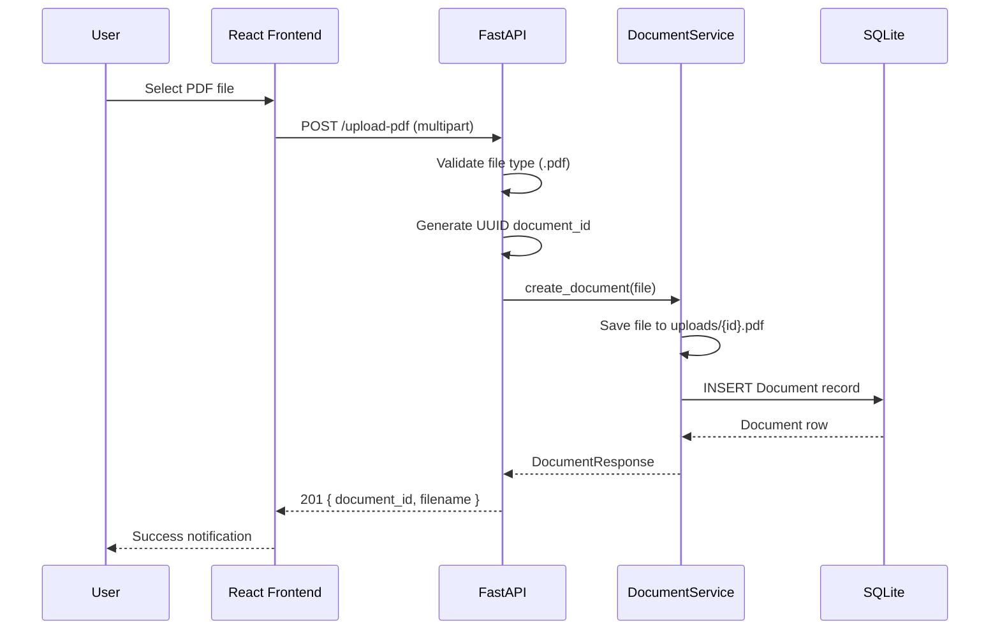
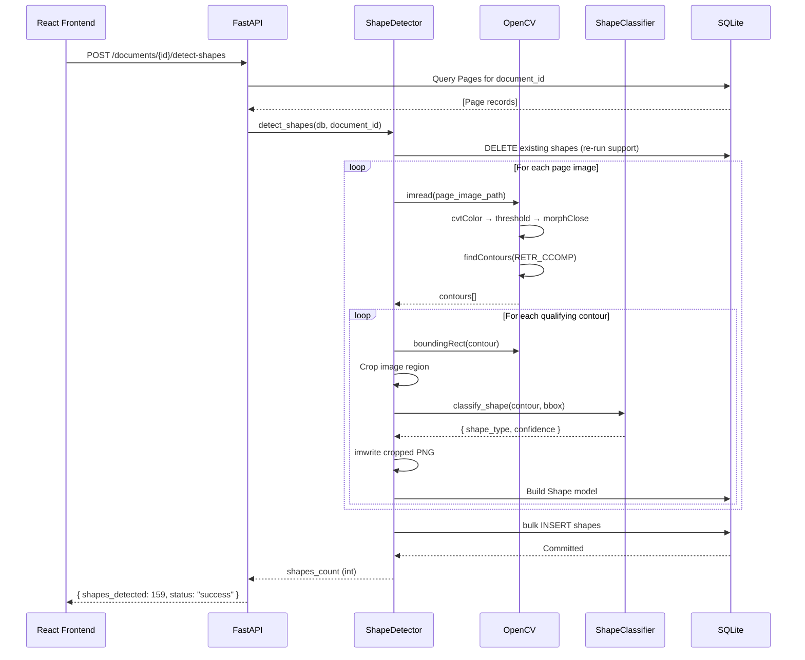
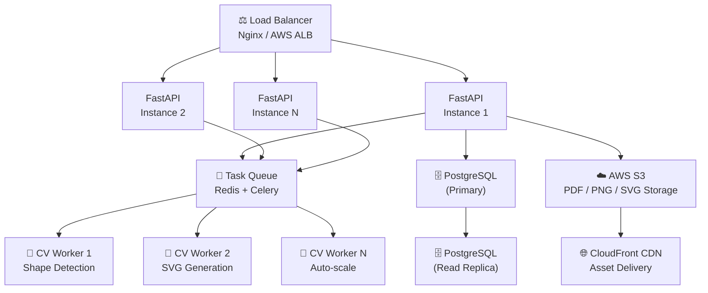

# SYSTEM_DESIGN.md — ShapeForge AI Architecture

## Table of Contents
1. [Requirements](#requirements)
2. [System Components](#system-components)
3. [Sequence Diagrams](#sequence-diagrams)
4. [Design Decisions](#design-decisions)
5. [Database Schema](#database-schema)
6. [Scalability Discussion](#scalability-discussion)

---

## 1. Requirements

### Functional Requirements

| ID | Requirement |
|----|-------------|
| FR-01 | System shall accept PDF file uploads via HTTP multipart POST |
| FR-02 | System shall validate uploaded files are valid PDFs |
| FR-03 | System shall store uploaded PDFs and persist metadata to database |
| FR-04 | System shall convert each PDF page to a high-resolution PNG image |
| FR-05 | System shall detect all symbol contours from page images |
| FR-06 | System shall crop each detected shape into an individual PNG |
| FR-07 | System shall classify shapes into geometric categories with confidence scores |
| FR-08 | System shall generate editable SVG vector files from shape contours |
| FR-09 | System shall allow custom JSON properties to be merged or replaced per shape |
| FR-10 | System shall export complete shape metadata as a downloadable JSON file |
| FR-11 | System shall provide a web dashboard for non-technical users |

### Non-Functional Requirements

| ID | Requirement | Target |
|----|-------------|--------|
| NFR-01 | API response time for read operations | < 200ms |
| NFR-02 | PDF processing time (single page, A4) | < 5 seconds |
| NFR-03 | Shape detection throughput | > 50 shapes/second |
| NFR-04 | System uptime | 99.9% |
| NFR-05 | File upload size limit | Up to 100MB |
| NFR-06 | Concurrent users (MVP) | 10 simultaneous |
| NFR-07 | API documentation | Auto-generated OpenAPI 3.0 |
| NFR-08 | Test coverage | > 80% service layer |

---

## 2. System Components

### Backend — FastAPI Application

```
┌─────────────────────────────────────────────────────┐
│                   FastAPI App (app/main.py)          │
│                                                     │
│  ┌─────────────┐    ┌─────────────────────────────┐ │
│  │  API Router │    │      Lifespan Events        │ │
│  │ (endpoints) │    │  (DB init, dir creation)    │ │
│  └──────┬──────┘    └─────────────────────────────┘ │
│         │                                           │
│  ┌──────▼──────────────────────────────────────┐   │
│  │              Service Layer                   │   │
│  │  ┌──────────┐  ┌──────────┐  ┌──────────┐   │   │
│  │  │ Document │  │   PDF    │  │  Shape   │   │   │
│  │  │ Service  │  │Processor │  │ Detector │   │   │
│  │  └──────────┘  └──────────┘  └──────────┘   │   │
│  │  ┌──────────┐  ┌──────────┐  ┌──────────┐   │   │
│  │  │Classifier│  │   SVG    │  │ Property │   │   │
│  │  │ Service  │  │Generator │  │ Service  │   │   │
│  │  └──────────┘  └──────────┘  └──────────┘   │   │
│  └─────────────────────────────────────────────┘   │
│         │                                           │
│  ┌──────▼──────────────────────────────────────┐   │
│  │           SQLAlchemy ORM Layer               │   │
│  │  Document Model | Page Model | Shape Model   │   │
│  └──────────────────────────────────────────────┘  │
└─────────────────────────────────────────────────────┘
```

**Key design choices:**
- **Service layer pattern**: All business logic isolated in `app/services/` — endpoints are thin wrappers
- **Dependency injection**: Database sessions injected via `Depends(get_db)` — testable and stateless
- **Pydantic v2 schemas**: Strict input/output validation with automatic OpenAPI generation
- **Static file serving**: Mounted at `/pages`, `/shapes`, `/svgs` for direct image access

### Database — SQLAlchemy + SQLite

Three-table normalized schema:

```
Document (1) ──── (N) Page (1) ──── (N) Shape
```

- **Document**: UUID, filename, file_path, uploaded_at
- **Page**: UUID, document_id (FK), page_number, image_path, width, height
- **Shape**: UUID, page_id (FK), shape_number, image_path, svg_path, x, y, width, height, shape_type, confidence, properties (JSON), created_at

### Computer Vision Pipeline

```
PNG Image
    │
    ▼ cv2.cvtColor(BGR → GRAY)
Grayscale
    │
    ▼ cv2.threshold(THRESH_BINARY_INV, 200)
Binary Mask (white shapes on black background)
    │
    ▼ cv2.morphologyEx(MORPH_CLOSE, 3×3 kernel)
Cleaned Mask (noise reduction, gap closure)
    │
    ▼ cv2.findContours(RETR_CCOMP, CHAIN_APPROX_SIMPLE)
Contour Hierarchy (includes nested shapes)
    │
    ▼ Area Filter (MIN_CONTOUR_AREA ≤ area ≤ MAX_CONTOUR_AREA)
Qualifying Contours
    │
    ▼ cv2.boundingRect(contour)
Bounding Boxes
    │
    ├──▶ Shape Crop PNG (image[y:y+h, x:x+w])
    │
    ▼ Geometric Classification
Shape Type + Confidence Score
    │
    ▼ svgwrite contour → SVG path
Editable SVG File
```

**Critical Design Choice — `RETR_CCOMP` vs `RETR_EXTERNAL`:**

`RETR_EXTERNAL` only retrieves outermost contours. For engineering diagrams with a surrounding border frame (common in P&ID drawings), the outer border becomes the dominant contour and all inner symbols are suppressed (0 shapes detected).

`RETR_CCOMP` constructs a 2-level hierarchy, correctly separating the outer border from inner symbol contours, enabling extraction of all embedded symbols.

### Frontend — React TypeScript

```
App.tsx (React Router)
    │
    ├── Dashboard.tsx
    │       ├── UploadCard.tsx (drag-and-drop, multipart POST)
    │       └── DocumentList.tsx (document library grid)
    │
    ├── DocumentDetail.tsx
    │       ├── Pipeline Controls (Extract → Detect → Vectorize)
    │       ├── Pages Preview Grid
    │       └── ShapeGrid.tsx
    │               └── ShapeCard.tsx (thumbnail + type badge)
    │
    └── ShapeDetail.tsx
            ├── SVGViewer.tsx (inline SVG + zoom/pan)
            └── PropertyEditor.tsx (key-value PATCH editor)
```

**State Management**: TanStack Query (React Query) — server state cached and invalidated per operation, no global store needed.

---

## 3. Sequence Diagrams

### PDF Upload Flow



### Shape Detection Flow



---

## 4. Design Decisions

### Why FastAPI?

| Factor | Decision |
|--------|----------|
| **Performance** | Async-capable, one of the fastest Python frameworks (comparable to NodeJS) |
| **Auto-documentation** | Generates OpenAPI 3.0 + Swagger UI automatically from type hints |
| **Type safety** | Native Pydantic v2 integration — request/response validation at the boundary |
| **DX** | Dependency injection, path operations, decorators feel natural and testable |
| **Ecosystem** | Uvicorn ASGI server, excellent with SQLAlchemy, production-ready |

### Why OpenCV?

| Factor | Decision |
|--------|----------|
| **Maturity** | 25+ years, battle-tested for industrial computer vision |
| **Algorithm breadth** | Full suite: thresholding, morphology, contour analysis, convex hull |
| **Performance** | C++ core with Python bindings — processes large PNG images in milliseconds |
| **No ML overhead** | Geometry-based classification requires no GPU, no training data, no inference cost |
| **Flexibility** | `RETR_CCOMP` hierarchy mode is critical for nested-boundary diagrams |

### Why SVG via svgwrite?

| Factor | Decision |
|--------|----------|
| **Editability** | SVG is XML — editable in any vector editor (Inkscape, Figma, Illustrator) |
| **Scalability** | Resolution-independent: scales to any DPI without quality loss |
| **Web-native** | Renders directly in browsers without plugins |
| **Programmatic** | svgwrite provides clean Python API for building SVG paths from contour points |
| **Standard** | W3C standard, supported by all modern toolchains |

### Why React + TypeScript?

| Factor | Decision |
|--------|----------|
| **Type safety** | TypeScript prevents API response shape mismatches at compile time |
| **Component model** | Natural decomposition: UploadCard, ShapeCard, SVGViewer are isolated units |
| **React Query** | Server state caching eliminates manual loading state management |
| **Vite** | Sub-second HMR, instant cold starts vs webpack |
| **Tailwind CSS** | Utility-first enables rapid UI iteration without CSS file overhead |

---

## 5. Database Schema

```sql
-- Documents table
CREATE TABLE documents (
    id          TEXT PRIMARY KEY,        -- UUID
    filename    TEXT NOT NULL,
    file_path   TEXT NOT NULL,
    uploaded_at DATETIME DEFAULT NOW()
);

-- Pages table
CREATE TABLE pages (
    id          TEXT PRIMARY KEY,        -- UUID
    document_id TEXT NOT NULL REFERENCES documents(id),
    page_number INTEGER NOT NULL,
    image_path  TEXT NOT NULL,
    width       INTEGER NOT NULL,
    height      INTEGER NOT NULL
);

-- Shapes table
CREATE TABLE shapes (
    id           TEXT PRIMARY KEY,       -- UUID
    page_id      TEXT NOT NULL REFERENCES pages(id),
    shape_number INTEGER NOT NULL,
    image_path   TEXT NOT NULL,
    svg_path     TEXT,
    x            INTEGER NOT NULL,
    y            INTEGER NOT NULL,
    width        INTEGER NOT NULL,
    height       INTEGER NOT NULL,
    shape_type   TEXT NOT NULL,
    confidence   REAL NOT NULL,
    properties   JSON,                   -- Free-form custom metadata
    created_at   DATETIME DEFAULT NOW()
);
```

---

## 6. Scalability Discussion

### Current Architecture (MVP)

```
Single FastAPI process
    ↓ (synchronous CV processing)
SQLite (file-based)
    ↓ (local disk)
File system storage
```

**Limitations**: SQLite has write contention with multiple users. CV processing is CPU-bound and blocks the request thread. Local file storage doesn't scale horizontally.

### Production Architecture



### Migration Path

| Component | MVP | Production |
|-----------|-----|------------|
| Database | SQLite | PostgreSQL + pgvector |
| Storage | Local filesystem | AWS S3 |
| Processing | Synchronous | Celery + Redis async queue |
| Compute | Single process | Kubernetes HPA auto-scale |
| CDN | None | CloudFront for images/SVGs |
| Auth | None | OAuth2 + JWT |
| Monitoring | Logs | Prometheus + Grafana |

### Scaling Estimates

| Load | Architecture |
|------|-------------|
| 10 users, 100 PDFs | Current MVP |
| 100 users, 10K PDFs | PostgreSQL + S3 |
| 1K users, 100K PDFs | Add Redis queue + Celery workers |
| 10K users, 1M PDFs | Full Kubernetes + read replicas + CDN |
